# DTG Sales Performance Analysis (H1 2025)

## Client Background

DTG is an Indonesia-based distributor that sells computer components across a range of brands. It supplies more than **350 retailers** and generated over **42 billion Indonesian Rupiah (2.6 million USD)** in sales over a six-month period.

The available data covers **January-June 2025**, including sales figures, brand breakdowns, e-commerce sales, and D2C (direct-to-consumer) store sales.

Reporting to the Revenue Manager, an in-depth analysis was conducted to evaluate DTG's performance over the six months across their different sales channels. This detailed review provides insights used to streamline processes and strengthen sales and commercial performance.

### Core Metrics

- **Sales Trend** - key metrics of sales revenue, number of orders placed, and average order value (AOV)
- **D2C Store Performance** - sales revenue, total units sold, and AOV across 4 different D2C stores
- **E-commerce Performance** - average order value, order volume, and sales trends to guide pricing, promotions, and channel strategy
- **Brand Performance** - analysis of different brands and their market impact

### Repo Contents

- `README.md` - this report
- `sql/` - SQL queries used for data cleaning and analysis
- `data/` - cleaned dataset (Excel)
- `images/` - chart visuals referenced in this report

**Tools used:** SQL (PostgreSQL), Excel, data visualization

---

## General Sales Trend

**Sales decline: 10.6% drop in March, 13% drop in May**

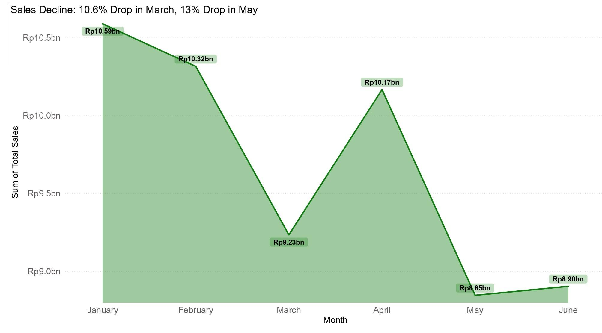

### Sales Revenue

1. **Sharp declines in March and May**
   - Sales fell from Rp10.32bn to Rp9.23bn (**-16.5%**) in March, and again from Rp10.17bn to Rp8.85bn (**-22%**) in May
   - These are the two steepest monthly drops across the entire six-month period
   - A brief recovery to Rp10.17bn in April did not hold, with sales closing June at Rp8.90bn - still well below the January peak

2. **High month-to-month volatility**
   - Sales swing sharply between months rather than following a steady trend, making performance difficult to forecast
   - Overall trajectory from January to June reflects a net decline of roughly **16%**, indicating a real decline in revenue base rather than normal fluctuation

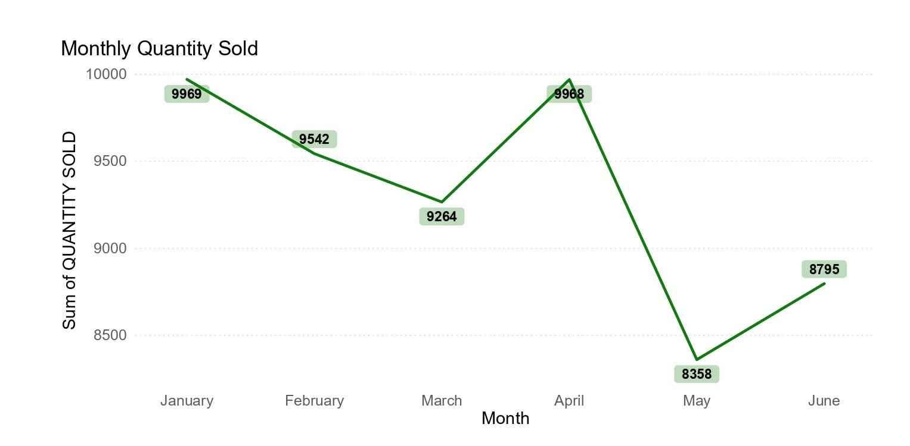

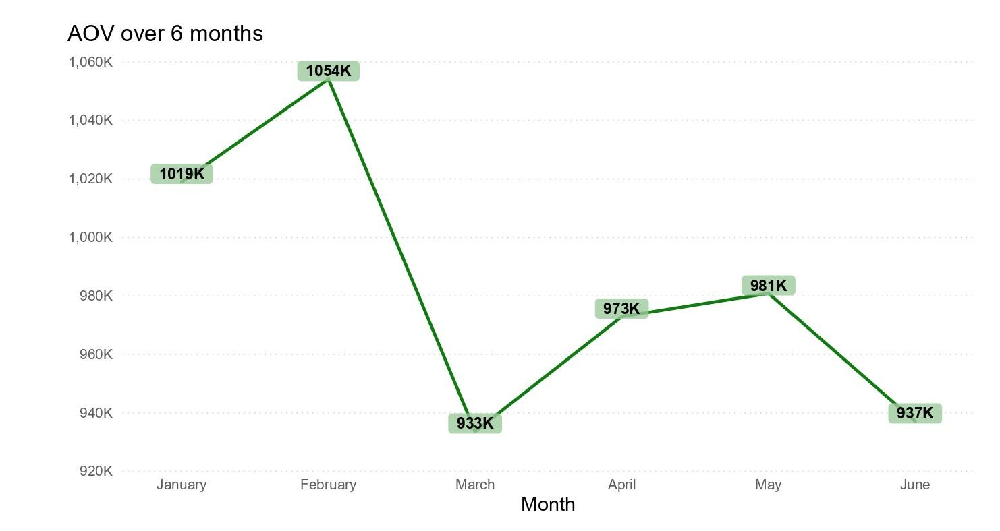

### Average Order Value

1. **AOV remains stable despite revenue swings**
   - AOV stayed within a narrow range of Rp933K-Rp1,054K across all six months
   - Even in May, when total sales bottomed out, AOV was Rp981K - near its second-highest point of the year
   - This indicates pricing and basket size are not the cause of the revenue decline

### Volume Sales

1. **Sharp volume drop in May**
   - Units sold fell from 8.0K in April to 6.3K in May, a **21%** single-month drop
   - This closely mirrors the 22% revenue decline in the same month, pointing to volume as the primary driver
   - Volume also dipped from 7.9K in January to 7.1K in March, tracking the March revenue decline as well

---

## Insights Breakdown

### D2C Store Performance

**Mangga Dua Mall drives over half of total D2C sales (56%)**

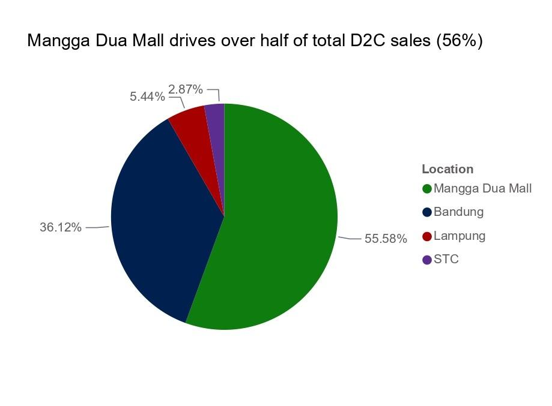

| Month | Bandung | Lampung | Mangga Dua Mall | STC |
|---|---|---|---|---|
| January | Rp2,362,772,000 | Rp187,197,000 | Rp2,315,851,000 | Rp99,455,000 |
| February | Rp1,316,014,000 | Rp268,660,000 | Rp2,136,121,000 | Rp135,169,000 |
| March | Rp1,169,871,000 | Rp119,099,000 | Rp2,327,921,500 | Rp91,044,000 |
| April | Rp1,765,384,500 | Rp259,684,000 | Rp2,108,812,000 | Rp110,233,000 |
| May | Rp1,166,860,000 | Rp178,831,500 | Rp2,505,222,000 | Rp166,663,000 |
| June | Rp1,101,673,000 | Rp324,520,000 | Rp2,275,370,000 | Rp102,695,000 |
| **Total** | **Rp8,882,574,500** | **Rp1,337,991,500** | **Rp13,669,297,500** | **Rp705,259,000** |

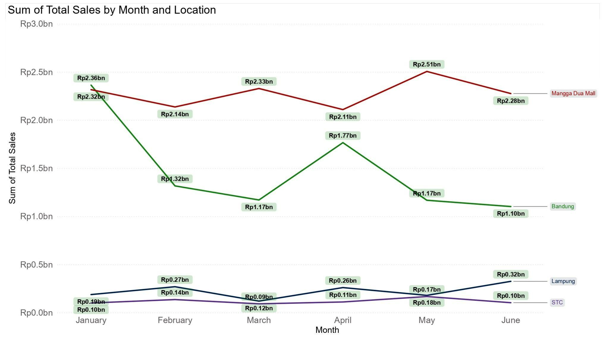

**D2C sales by location:**

1. **Bandung declining sales**
   - Bandung fell from Rp2.36bn to Rp1.10bn (**-53%**) between January and June
   - Sliding from the second-strongest location to the weakest throughout the six months
   - A sharp and consistent decline suggests a location-specific issue rather than normal seasonal fluctuations

2. **Lampung volatility**
   - Lampung's revenue is highly volatile (ranging Rp119K-Rp325K) with no consistent trend, though there's a mild increase in the second-half average vs. the first half

3. **Mangga Dua Mall consistent but not growing**
   - Holds **56%** of total D2C sales, but moved less than **2% net** over six months (Rp2.32bn to Rp2.28bn), indicating consistent scale but not growth

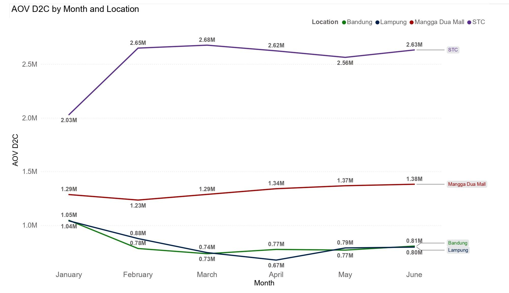

**Average Order Value (D2C store):**

1. **Bandung AOV crashed 26% in February**
   - AOV crashed (Rp1.05M to Rp0.78M) and never bounced back, staying low until June despite strong unit sales - may indicate a pricing or product-mix issue rather than weak demand

2. **Mangga Dua Mall's AOV grows steadily**
   - Increased by **7%** (Rp1.29M to Rp1.38M), the only store with a consistent upward trend - helps protect revenue even when sales volume drops

3. **Lampung AOV slight dip**
   - Dropped **-23.8%** (Rp1.05M to Rp0.80M), but the impact is countered by strong volume growth

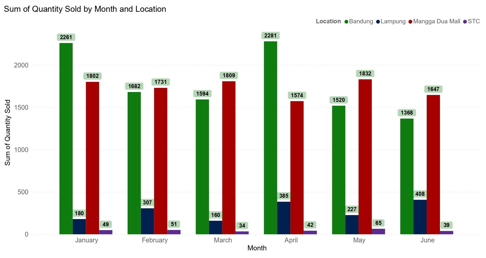

**Quantity Sold (D2C store):**

1. **Bandung's high volume isn't converting to revenue**
   - Bandung sells the highest volume of any store (peak at 2,281 units in April), but the high volume has not produced more revenue - any store strategy should target pricing, not traffic

2. **Mangga Dua Mall's volume is stable, with revenue driven by price**
   - Volume stayed relatively stable (1,574-1,832 units/month) apart from an April dip - its revenue strength comes from price, not volume

3. **Lampung growing both price and volume**
   - More than doubled its volume (180 to 408 units, **+127%**) - the only store that improves on both price and volume

---

### E-commerce Sales

**Throughout 6 months, Tokopedia sales peak in March**

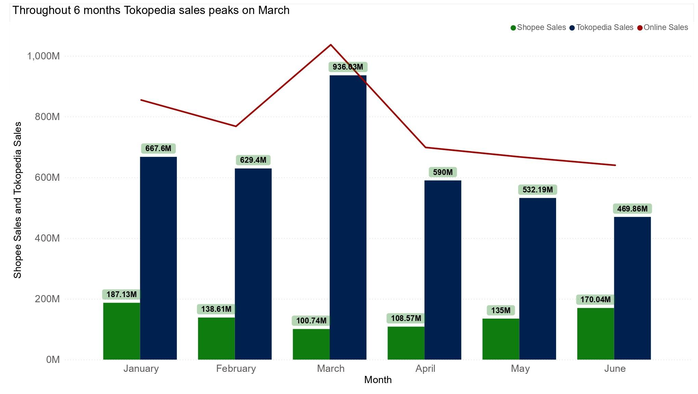

1. **Tokopedia's March spike masked a broader online sales decline**
   - Online sales peaked in March at roughly Rp1.04bn combined, driven almost entirely by Tokopedia (Rp936.83M)
   - From March, sales dropped **38%** - Rp936.83M (March) to Rp469.86M (June) - a downward trend across consecutive months

2. **Online sales moved opposite to overall company sales in March**
   - While total company sales hit their lowest point (Rp9.23bn), the online channel hit its highest point the same month

3. **Tokopedia is the dominant online platform, but the gap is narrowing**
   - Tokopedia outsold Shopee every month, typically by 3-5x, contributing the large majority of total online revenue
   - Since March, Tokopedia's lead has shrunk steadily as Tokopedia declined while Shopee grew

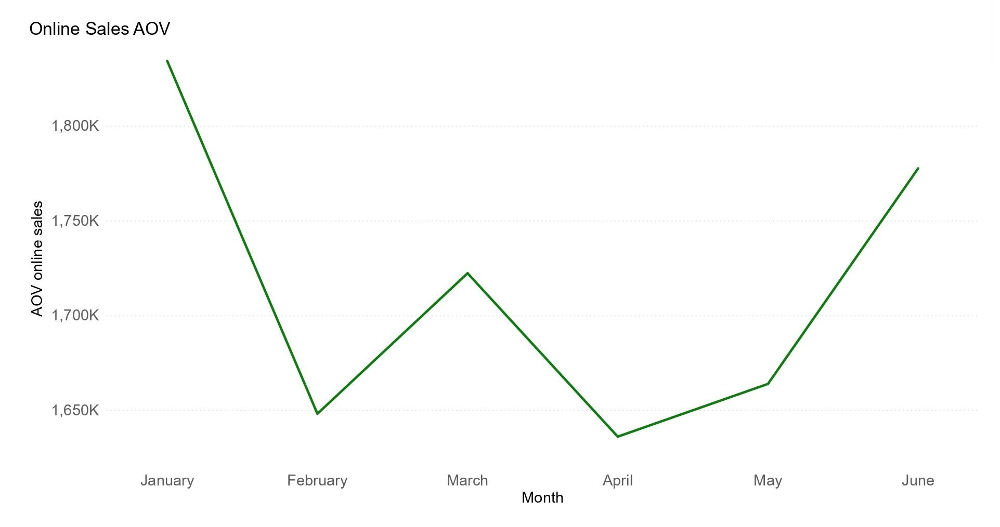

**Average Order Value (E-commerce):**

1. **Online AOV dropped sharply after January and hasn't fully recovered**
   - AOV fell **10%** from January to February (Rp1.84M to Rp1.65M) before recovering to Rp1.78M in June

2. **Online AOV is more volatile than D2C store AOVs**
   - Unlike D2C stores, which held a steady trend, online AOV swung up and down each month - may reflect a shift in product mix, promotions, or discounting through the online channel

---

### Brand Performance

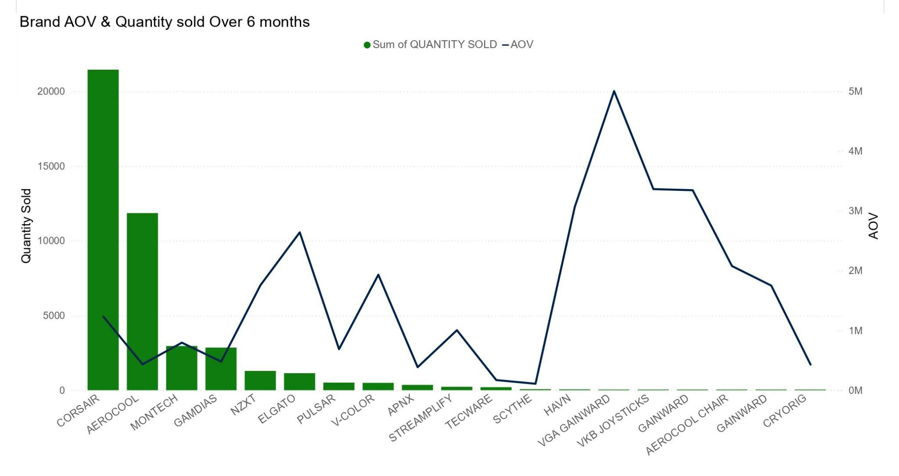

**AOV & Quantity Sold:**

1. **Corsair and Aerocool drive volume, but at below-average order value**
   - Corsair sells by far the most units (~21,500), more than any other brand, but its AOV (~Rp1.2M) sits well below top-tier brands like Elgato or the premium niche brands

2. **Elgato and V-Color stand out as mid-volume, above-average AOV performers**
   - Elgato (~Rp2.6M AOV) and V-Color (~Rp1.9M AOV) combine moderate unit sales with stronger pricing than Corsair or Aerocool - above their volume in revenue contribution and may be worth featuring more

3. **A group of niche brands command premium pricing on minimal volume**
   - Brands like VGA Gainward (~Rp5M AOV), VKB Joysticks, Gainward, and Aerocool Chair post the highest AOV in the portfolio but sell only a handful of units each - indicating low-volume premium/accessory items rather than volume drivers

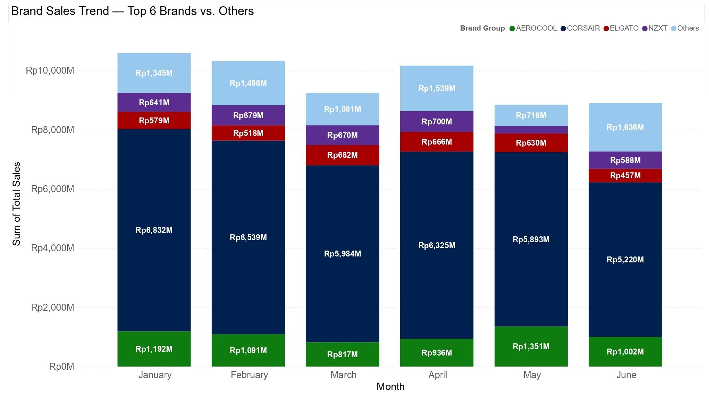

**Top Brands vs. Others:**

1. **Corsair remains the dominant brand but is in steady decline**
   - Corsair consistently makes up 65-75% of total brand sales each month, but fell **24%** from January to June (Rp6,832M to Rp5,220M) as the largest brand by far
   - This decline is the main driver behind the overall H1 sales slowdown

2. **Aerocool dipped in Q1 but recovered by May**
   - Aerocool dropped to its lowest point in March (Rp817M), in line with the overall Q1 decline seen company-wide
   - In May it started climbing back to Rp1,351M, its strongest month, then easing slightly in June (Rp1,002M)

3. **"Others" grew notably in June, reversing a mid-year decline**
   - The "Others" category ranged between Rp700M-1,500M for most of the period but jumped to Rp1,636M in June, its highest point of H1
   - In the same month Corsair hit its lowest sales, suggesting some demand may be shifting toward smaller or non-top-6 brands

---

## Recommendations

### Overall Sales
- Run an investigation to find the root cause of the March and May declines:
  - March shows AOV falling twice as fast as volume (pricing/discounting activity)
  - May shows flat AOV but volume down 21.3% (demand/stockout issue)
  - Two different causes in the same six-month window suggest they need separate but coordinated investigation

### D2C Store Sales
- Break down Bandung's decline by brand:
  - Bandung's D2C revenue fell from Rp2.36bn to Rp1.10bn (**-53%**, Jan-June) despite April unit sales hitting 2,281, the highest of any location that month - meaning volume isn't the problem
- Investigate local factors (competition, staffing, in-store trends):
  - Bandung AOV crashed 26% in February (Rp1.05M to Rp0.78M) and never recovered through June, even as unit sales stayed relatively strong
- Check inventory/stock levels around May:
  - Company-wide May volume fell 21.3% while AOV stayed flat - a pattern showing stockouts rather than pricing or demand softness

### E-commerce Sales
- Investigate drivers of online AOV volatility:
  - Online AOV swings every month (Rp1.84M to Rp1.65M to Rp1.70M to Rp1.64M to Rp1.68M to Rp1.78M) versus D2C store AOVs, which move more steadily month to month
- Review March's marketing/promo activity:
  - Online AOV swung from Rp1.84M (Jan) down to Rp1.65M (Feb) then up to Rp1.70M (Mar), while Tokopedia sales spiked - volatility likely due to promotional activity

### Brand Performance
- Investigate whether the Corsair decline is location-specific:
  - Corsair fell 24% company-wide (Rp6,832M to Rp5,220M, Jan-June) while making up 65-75% of total brand sales
  - Bandung's following 53% D2C decline
- Investigate stockouts or spend cuts for Corsair:
  - Corsair's steady decline is described as the main driver behind the overall H1 sales slowdown; currently no cause (supply, marketing, pricing) is identified in the current data
- Monitor the "Others" category's June growth:
  - "Others" jumped to Rp1,636M in June (its H1 high) in the same month Corsair hit its lowest sales (Rp5,220M) - a possible early sign of share shifting from top brands
